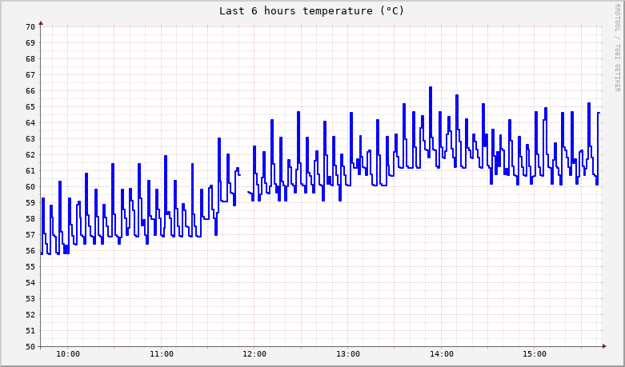
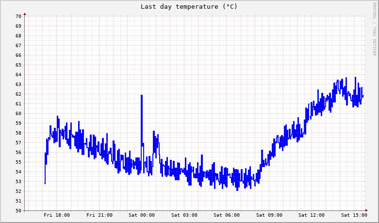

# A simple script to log cpu temperature on a rpi #

## Dependancies ##
Obviously, you need `rrdtool`.

## Install ##
Just modify the **path of the db** in `rrd.sh` to point where you want your db to lie.

Hint: Better not host that file on the *SD card* or *USB key* because it will be update every minute (unless you change that). So prefer a *good old fashion HDD* or a *SSD*.

Then configure *any cron like service* to run the script every minute.

Here are provided *systemd files* to be run as user timer systemd services.

First you need to enable *linger* for your user, so that the timer is run even if your user is not logged in

    systemctl enable-linger myuser

Then you move the 2 files (rrd.service and rrd.timer) in `~/.config/systemd/user`. You may have to create this directory.

Then you run

    systemctl --user enable rrd.timer
    systemctl --user start rrd.timer

Once, you have collected some data, you can get a graph by running `./rrd.sh plot`. The script generates 4 png for the last hour, the last 6 hours, the last day, the last week.

For example:

